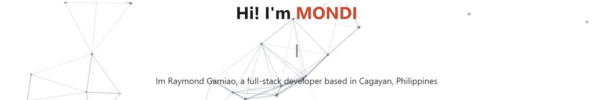

## 👋Hi there!

I'm a Full-stack Developer equipped with a diverse skill-set including web development, graphic design, and hardware servicing among others. Having an optimistic outlook and being open to learning new skills, I can function well both on my own and in a group.

- 🔭 I’m currently looking for opportunities

- 🌱 I’m currently learning Laravel

- 🌐 Visit my [porfolio website](https://mondi.vercel.app/) for complete info.

- 📫 How to reach me: raymondgamiao@gmail.com

<h3 align="left">Connect with me:</h3>

<h3 align="left">Languages and Tools:</h3>

               

<!-- start Recent Projects section -->

<b> My Recent Projects </b>

<table>
  <thead>
    <tr>
      <th>Project Name</th>
      <th>Skills used</th>
      <th>Description</th>
    </tr>
  </thead>
  <tbody>
    <tr>
      <td><a href='https://react-weather-app-z9t3.vercel.app/'>Weather App</a></td>
      <td>ReactJS, Tailwind, API</td>
      <td>Shows current weather with 7 day forecast based on location</td>
    </tr>
   <tr>
      <td><a href='https://github.com/raymondgamiao/capstone/'>PhotoCity</a></td>
      <td>Laravel, HTML, Jquery, MySQL</td>
      <td>Booking with Inventory and Employee management systems for a Photo Video Company</td>
    </tr>
    <tr>
      <td><a href='https://raymondgamiao.github.io/m2/'>Legend.GG
</a></td>
      <td> HTML, Bootstrap, RIOT's API</td>
      <td>This is a companion web app for League of Legend players. Note: You have to clone my repo and insert your own Riot API key to make all features work</td>
    </tr>
    <tr>
      <td><a href='https://raymondgamiao.github.io/mondemy/'>Mondemy</a></td>
      <td>HTML, Bootstrap, Javascript</td>
      <td> First Mini Project for KODEGO Bootcamp. It is a resource website for aspiring web developers</td>
    </tr>
    <tr>
      <td><a href='https://raymondgamiao.github.io/Mondi-Graphics/'>First Portfolio</a></td>
      <td>HTML, Bootstrap, Javascript</td>
      <td> This is my previous portfolio before learning web development. It showcases my skills as a graphic designer</td>
    </tr>
  </tbody>
</table>

<!-- end Recent Projects section -->

<!-- start Github Stats section -->

<b> Github Stats </b>

<!-- end Github Stats section -->

